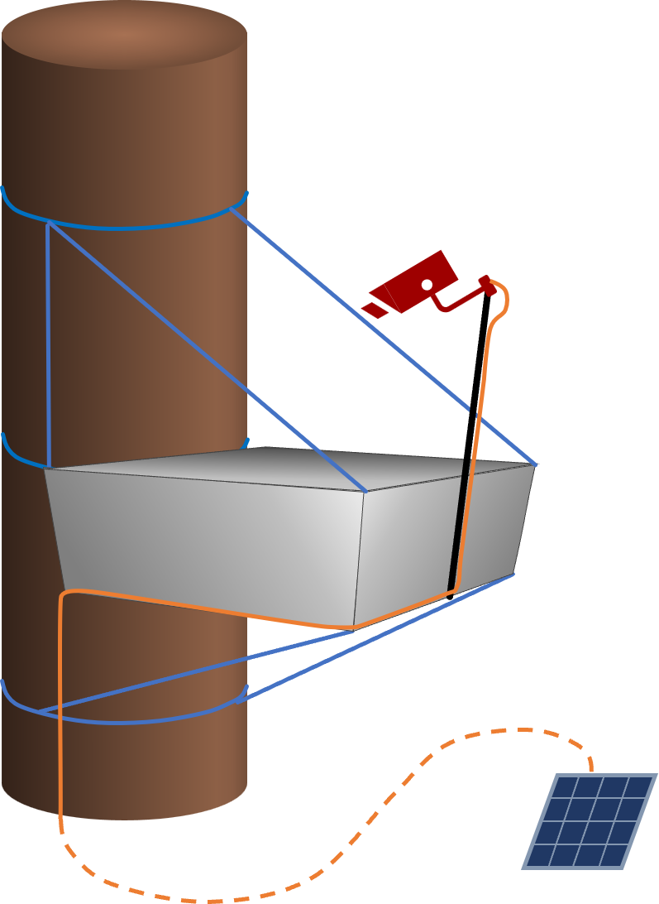
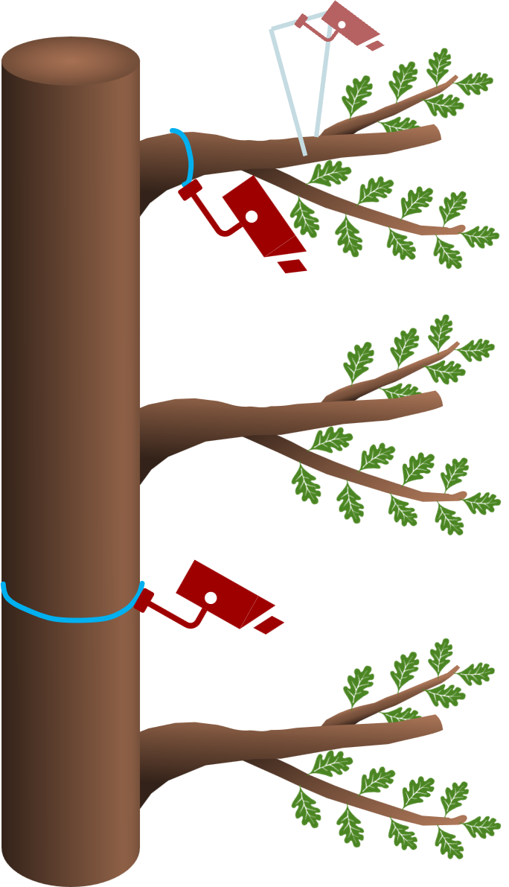

The canopy exposition experiments expose oak clonal saplings to the varying microclimates of three canopy layers (upper, middle, ground) of mature trees to identify, whether A&A patterns in relation to drought and herbivore stressors observed in the controlled environments of the Ecotrons can also be observed in these more complex environments and to compare them to canopy twigs and to naturally regenerating saplings on the ground.

# Setup

There are 3 cameras placed on the platforms themeselves, 1 per platform. Additionally, there is one camera per stratum placed at a nearby branch of the adult tree.

