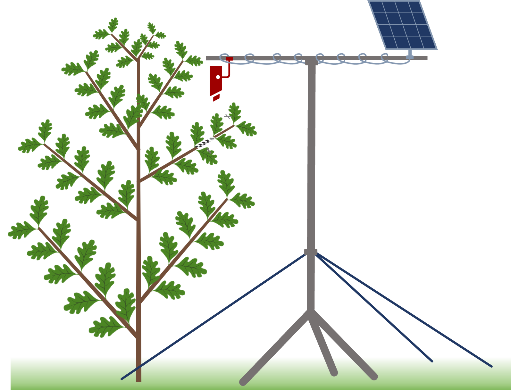

The European transect study assesses clonal oak saplings released across Germany and Europe for analyzing A&A patterns under a wide range of environmental conditions.

# Setup

On each plot, three cameras are installed, each monitoring a **north facing target branch** on a focal tree. Cameras are installed on a tripod beside the tree.
If you need to temporarily move the tripod, e.g. to sample the soil beneath the tripod, please follow the <a href="../assets/CameraMovementProtocol.pdf">movement protocol</a>!

